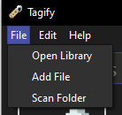
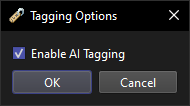

# Adding a file

## Step 1.

To add a file, open the File menu and click on `Add File`.

After that, a dialog will appear asking you to use AI to tag the file.

## Step 2.

After clicking `Ok`, a file selector will be opened. Select the file you want to add and click `Open`.

The AI will tag it if it has a supported file extension and if you enabled AI tagging. If not, you will have to tag it manually.