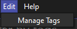
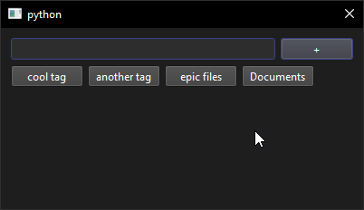

# Creating tags

Tags are the way Tagify organizes your files. They are used to categorize files and make them easier to find.

!!! info
    AI cannot currently generate tags. This will be added in a future release.

Open the Edit menu.

Click on `Manage Tags`.

Type in the tag name in the text box then click the plus button.

!!! warning
    You can't delete tags yet. This will be added in a future release.