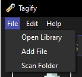

# Opening a library

After installing and running Tagify, you will need to open a library to start organizing your files.

Open the File menu on the menubar, and click on `Open Library`.

Select a directory for the library to live in.

!!! info
    A `.Tagify` directory will be created in the selected directory.

After that, the library will be opened and you will be able to start adding files to it.