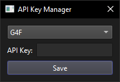

# Setting up G4F

## Step 1: Install Python

Download and install Python from the official website: [https://www.python.org/downloads/](https://www.python.org/downloads/)


## Step 2: Install G4F

Open a CMD window and run the following command:

```bash
pip install g4f fastapi uvicorn
```

## Step 3: Run G4F

Run the following command in the CMD window:

```bash
g4f api
```

## Step 4. Connect the app to G4F

In Tagify, open the Edit menu and click on `API Key Manager`



In the dialog, on the dropdown menu: select G4F.

The API key doesn't matter, you can put anything you want.
