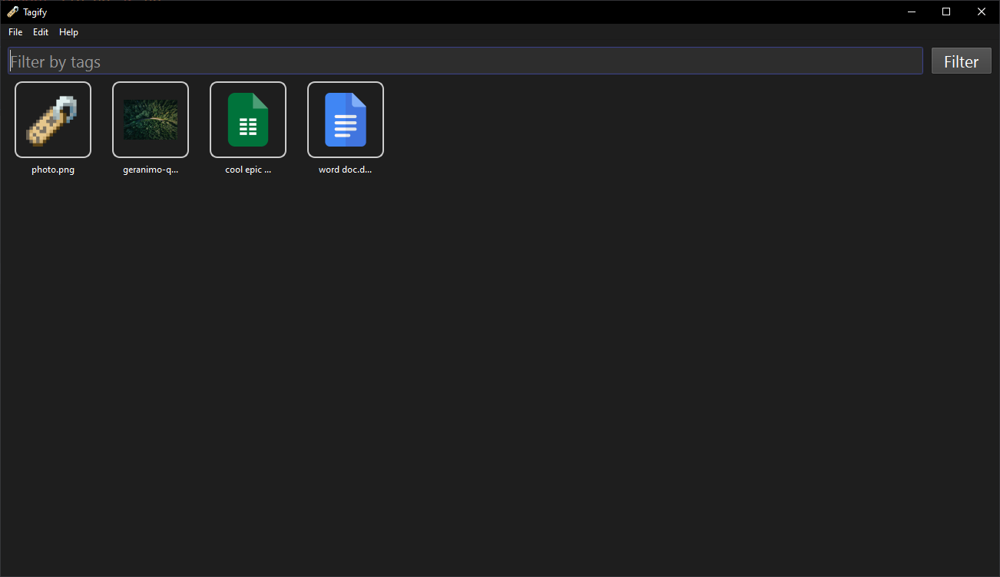

# Getting Started

Welcome to the Tagify documentation! Tagify is an AI powered file organizer that helps you organize your files in a more efficient way. This documentation will help you get started with Tagify and understand how to use it.

!!! warning
    This documentation is a work in progress.

!!! info
    Tagify is licensed under the GNU General Public License v3.0. You can find the source code on [GitHub](https://github.com/TagifyProject/Tagify).

> The Tagify UI

## Installation

To install Tagify, download the latest installer from the [releases page](https://github.com/TagifyProject/Releases/releases).

Then, go through the wizard like you would with any other software.

## Goals

- Organize files in a more efficient way
- Make it easier to find files
- Save time by automating the organization process

## Inspiration

Tagify has heavily been inspired by the following projects, but they didn't really fit my needs.
I needed something QUICK. Something that could run for some time, then automatically tag all my files.

- TagStudio
- Google Photos
- PhotoPrism

## Supporters

> Thank you to Zagreb Data for providing me with a computer powerful enough to support what I'm doing.

> Their primary product is Apross, a professional ERP system.
> You can check them out [here](https://www.zgdata.hr/).
